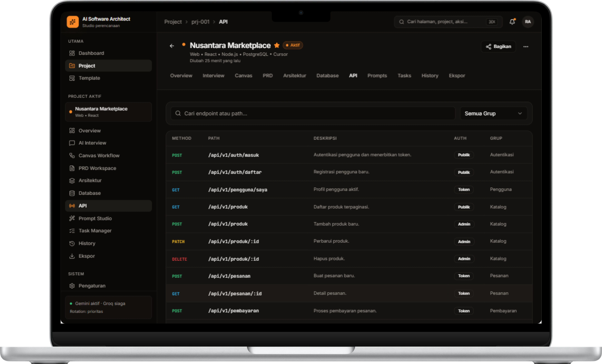

# 🔌 Dokumentasi 4: API Spec & Endpoint Generator

Dokumen ini menjelaskan modul **API Specification** pada platform **AI Software Architect** untuk perancangan kontrak antarmuka pemrograman aplikasi (API Interface Contract).

---

## 📡 Katalog Endpoint REST API

Modul API memungkinkan tim merekayasa dan mendokumentasikan seluruh daftar endpoint aplikasi sebelum penulisan kode dimulai.

### Struktur Tabel Spesifikasi API:

| HTTP Method | Path Endpoint | Deskripsi Singkat | Skema Auth | Grup Fitur |
| :--- | :--- | :--- | :--- | :--- |
| `POST` | `/api/v1/auth/masuk` | Autentikasi pengguna dan menerbitkan token JWT. | **Publik** | Autentikasi |
| `POST` | `/api/v1/auth/daftar` | Registrasi pengguna baru. | **Publik** | Autentikasi |
| `GET` | `/api/v1/pengguna/saya` | Memuat data profil pengguna aktif. | **Token** | Pengguna |
| `GET` | `/api/v1/produk` | Memuat daftar produk terpaginasi. | **Publik** | Katalog |
| `POST` | `/api/v1/produk` | Menambahkan produk baru ke katalog vendor. | **Admin** | Katalog |
| `PATCH` | `/api/v1/produk/:id` | Memperbarui data produk berdasarkan ID. | **Admin** | Katalog |
| `DELETE` | `/api/v1/produk/:id` | Menghapus produk dari katalog. | **Admin** | Katalog |
| `POST` | `/api/v1/pesanan` | Membuat transaksi pesanan baru. | **Token** | Pesanan |
| `GET` | `/api/v1/pesanan/:id` | Memuat rincian detail pesanan. | **Token** | Pesanan |
| `POST` | `/api/v1/pembayaran` | Memproses pembayaran melalui payment gateway. | **Token** | Pembayaran |

---

## ⚙️ Fitur Pengelolaan API:
- **Filtering & Grouping**: Menyaring endpoint berdasarkan kelompok modul (*Autentikasi*, *Katalog*, *Pesanan*, *Pembayaran*).
- **Authentication Tagging**: Memberikan penanda tingkat akses keamanan secara jelas (`Publik`, `Token / Bearer`, `Admin / Vendor`).
- **Standardized Naming Convention**: Menjaga standar penamaan URL RESTful API secara konsisten di seluruh tim pengembang.

---

## 📌 Kembali ke Dokumentasi Utama

- 🏠 **[Kembali ke README Utama](README.md)**
