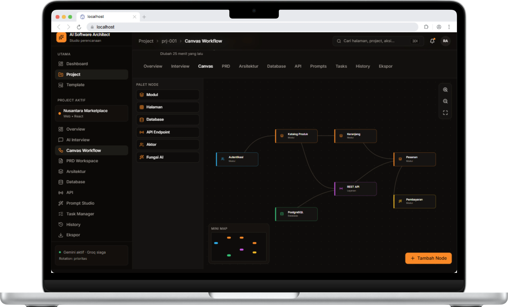
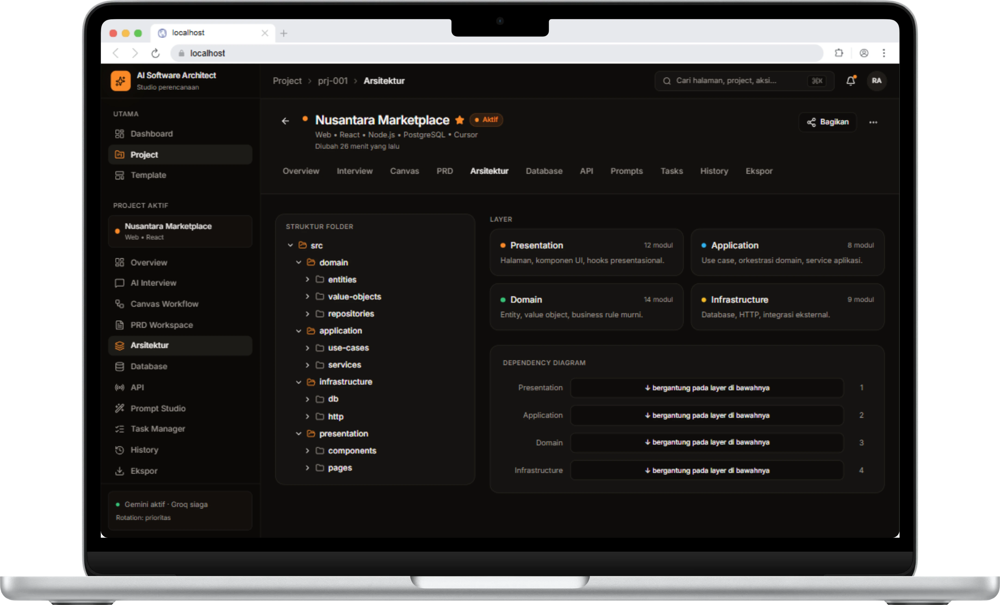
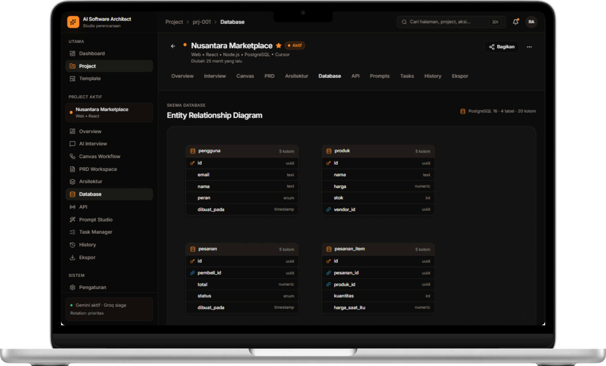

# 🔄 Dokumentasi 2: Canvas Workflow & Visualisasi Arsitektur

Dokumen ini memuat panduan penggunaan **Canvas Workflow**, **Struktur Arsitektur Layer**, dan **Visualisasi ERD Database** pada platform **AI Software Architect**.

---

## 🎨 1. Interactive Canvas Workflow

Canvas Workflow adalah modul visual interaktif berbasis diagram node yang memungkinkan pengembang memetakan aliran logika aplikasi, modul, dan dependensinya.

### Komponen & Palet Node Canvas:
1. **Palet Node**:
   - 📦 **Modul**: Komponen fungsional utama (misal: *Autentikasi*, *Katalog Produk*, *Keranjang*, *Pesanan*, *Pembayaran*).
   - 🖥️ **Halaman**: Antarmuka pengguna visual / router.
   - 🗄️ **Database**: Entitas penyimpan data (misal: *PostgreSQL*).
   - 🔌 **API Endpoint**: Node penghubung komunikasi data (misal: *REST API*).
   - 👤 **Aktor**: Peran pengguna (Admin, Vendor, Pembeli, Kurir).
   - ⚡ **Fungsi AI**: Integration node untuk fitur AI/ML.
2. **Konektor Dependensi**:
   - Garis penghubung otomatis yang menunjukkan aliran data dan relasi antar modul secara visual.
3. **Mini Map & Navigation**:
   - Navigasi cepat untuk proyek berskala besar dengan zoom in/out dan *fit view controls*.

---

## 🏛️ 2. Struktur Arsitektur Layer & Folder

Modul Arsitektur membantu mengorganisir arsitektur perangkat lunak mengikuti prinsip **Clean Architecture** / **Domain-Driven Design (DDD)**.

### Pembagian Layer Utama:
- 📱 **Presentation Layer**: Halaman UI, komponen visual, dan presentational hooks (`src/presentation/components`, `src/presentation/pages`).
- ⚙️ **Application Layer**: Use-case aplikasi, pengatur aliran kerja, dan service orchestration (`src/application/use-cases`, `src/application/services`).
- 💎 **Domain Layer**: Entity murni, value objects, dan aturan bisnis terisolasi (`src/domain/entities`, `src/domain/value-objects`, `src/domain/repositories`).
- 🔌 **Infrastructure Layer**: Implementasi database, HTTP client, dan integrasi API pihak ketiga (`src/infrastructure/db`, `src/infrastructure/http`).

---

## 🗂️ 3. Visualisasi Database (ERD)

Platform secara otomatis mengubah definisi entitas menjadi diagram hubungan entitas (**Entity Relationship Diagram - ERD**).

### Fitur Skema Database:
- **Tabel & Atribut**: Menampilkan struktur tabel lengkap dengan tipe data (UUID, Text, Numeric, Enum, Timestamp, Int).
- **Dukungan RDBMS**: Mendukung PostgreSQL 16+, MySQL, dan SQLite.
- **Relasi Entitas**: Memperlihatkan hubungan *Primary Key* (`id`) dan *Foreign Key* (`pembeli_id`, `vendor_id`, `pesanan_id`, `produk_id`).

---

## 📌 Kembali ke Dokumentasi Utama

- 🏠 **[Kembali ke README Utama](README.md)**
