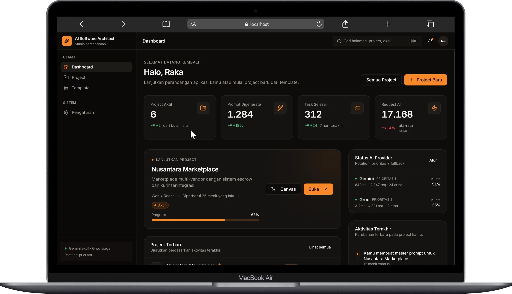

# 📊 Dokumentasi 1: Dashboard & Manajemen Project

Dokumen ini menjelaskan modul **Dashboard Utama**, **Manajemen Project**, **Pustaka Template**, dan **Status AI Provider** pada platform **AI Software Architect**.

---

## 💻 1. Dashboard Utama

Dashboard utama menyajikan ringkasan eksekutif seluruh aktivitas arsitektur dan status sistem secara real-time.

### Komponen Utama Dashboard:
1. **Statistik Penggunaan & Metrik Key Indicators**:
   - **Project Aktif**: Jumlah proyek yang sedang dikembangkan/dirancang.
   - **Prompt Digenerate**: Total prompt yang telah dihasilkan oleh sistem AI.
   - **Task Selesai**: Jumlah tugas perancangan yang telah diselesaikan.
   - **Request AI**: Total permintaan ke provider AI beserta tren harian.
2. **Project Terakhir (Quick Resume)**:
   - Menampilkan proyek yang paling baru dimodifikasi (contoh: *Nusantara Marketplace*) beserta progres penyelesaian (misal: 68%).
   - Tombol pintas untuk membuka **Canvas Workflow** atau **Overview Project**.
3. **Status AI Provider (Failover & Monitoring)**:
   - **Gemini**: Prioritas 1 (Status latency, total request, error rate, dan sisa kuota).
   - **Groq**: Prioritas 2 / Fallback (Status siaga dan latensi response).
4. **Log Aktivitas Terakhir**:
   - Memantau perubahan terbaru yang dilakukan pada project (seperti pembuatan master prompt, pembaruan PRD, generasi pertanyaan interview, dll.).

---

## 📁 2. Manajemen Daftar Project

Modul **Project** memungkinkan pengguna mengelola seluruh portofolio perencanaan aplikasi.

.webp)

### Fitur Utama:
- **Filter & Pencarian**: Pencarian berdasarkan nama project, platform (Web, Desktop, Mobile, PWA), status (Aktif, Review, Arsip), dan pengurutan terbaru.
- **Tampilan Grid & List**: Pengguna dapat mengubah tata letak antarmuka sesuai kenyamanan.
- **Kartu Project (Project Card)**:
  - Menyajikan nama project, deskripsi singkat, indikator teknologi (React, Next.js, Electron, Flutter, Astro), status progres (misal: 84%), dan waktu pembaruan terakhir.

---

## 📑 3. Pustaka Template Aplikasi

Modul **Template** menyediakan cetak biru (blueprint) siap pakai untuk mempercepat inisiasi proyek baru.

.webp)

### Kategori Template Siap Pakai:
- **Marketplace / E-Commerce**: Platform multi-vendor lengkap dengan katalog, keranjang, escrow, dan sistem kurir.
- **ERP (Enterprise Resource Planning)**: Manajemen inventori, keuangan, HR, dan pengadaan bisnis.
- **CRM (Customer Relationship Management)**: Manajemen relasi pelanggan dan pipeline penjualan.
- **Landing Page & Marketing**: Halaman konversi tinggi dengan section hero, fitur, dan pricing.
- **AI Chat App**: Antarmuka chatbot dengan streaming response dan riwayat percakapan.
- **POS (Point of Sale)**: Aplikasi kasir offline-first dengan pencetakan struk dan sinkronisasi data.

---

## 📌 Kembali ke Dokumentasi Utama

- 🏠 **[Kembali ke README Utama](README.md)**
