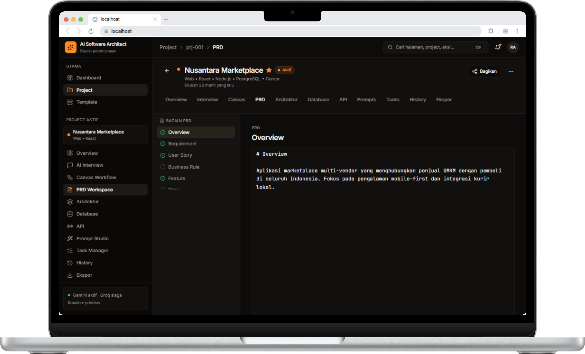

# 📄 Dokumentasi 3: PRD & Spesifikasi Sistem

Dokumen ini menjelaskan modul **Product Requirement Document (PRD Workspace)** dan **Overview Project** pada platform **AI Software Architect**.

---

## 📌 1. Project Overview & Metrik Progres

Sebelum memasuki penyusunan spesifikasi teknis terperinci, halaman Overview memberikan ringkasan status kesehatan dan kelengkapan dokumen proyek.

.webp)

### Informasi Ringkas Overview:
- **Progres Keseluruhan**: Persentase kelengkapan perancangan proyek (misal: 68%).
- **Task Selesai**: Jumlah tugas perancangan yang telah diselesaikan (misal: 2 dari 7 task).
- **Jumlah API & Prompt**: Total endpoint API yang telah didefinisikan serta jumlah prompt AI yang siap digenerate.
- **Tautan Akses Cepat**:
  - *Lanjutkan Interview AI* (Sesi tanya jawab otomatis untuk menggali kebutuhan produk).
  - *Buka PRD Workspace*.
  - *Task Manager* & *Prompt Studio*.

---

## ✍️ 2. PRD Workspace (Product Requirement Document)

Modul **PRD Workspace** menyediakan repositori terpusat untuk menyusun spesifikasi kebutuhan aplikasi secara rinci dan terstruktur.

### Bagian Dokumen PRD:
1. **Overview & Objective**:
   - Penjelasan visi produk, masalah yang diselesaikan, target audiens, dan fokus pengalamannya (misal: aplikasi marketplace multi-vendor berfokus pada pengalaman mobile-first dan kurir lokal).
2. **System Requirements**:
   - Kebutuhan fungsional (Functional Requirements) dan non-fungsional (performa, keamanan, skalabilitas).
3. **User Stories & Flow**:
   - Skenario pengguna dari sudut pandang Pembeli, Penjual/Vendor, dan Administrator.
4. **Business Rules**:
   - Aturan bisnis spesifik seperti komisi transaksi, aturan pencairan dana escrow, dan batasan pengiriman.
5. **Feature Specification**:
   - Rincian breakdown modul fitur beserta kriteria penerimaan (*Acceptance Criteria*).

---

## 📌 Kembali ke Dokumentasi Utama

- 🏠 **[Kembali ke README Utama](README.md)**
