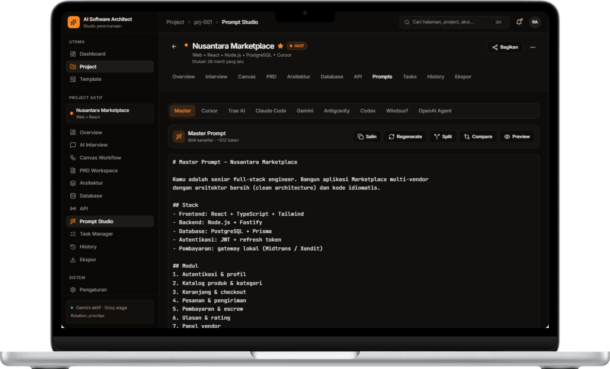

# 🤖 Dokumentasi 5: Prompt Studio & AI Export

Dokumen ini memuat panduan penggunaan modul **Prompt Studio** pada platform **AI Software Architect** untuk mentransformasikan hasil perancangan arsitektur menjadi instruksi *Master Prompt* presisi tinggi bagi berbagai AI Coding Assistant.

---

## 🛠️ Master Prompt Generator

Prompt Studio secara otomatis mengumpulkan seluruh artefak proyek (PRD, Arsitektur Layer, Database ERD, dan API Spec) lalu mengompilasinya menjadi **Master Prompt**.



### Dukungan AI Coding Assistant Target:
Prompt Studio menyediakan preset format prompt khusus yang dioptimalkan untuk:
- ⚡ **Master** (General / Multi-agent standard)
- 🖱️ **Cursor** (.cursorrules & system prompts)
- 🚀 **Trae AI**
- 💻 **Claude Code**
- ♊ **Gemini / Antigravity IDE**
- 🧠 **Codex & OpenAI Agent**
- 🌊 **Windsurf**

---

## 📋 Contoh Output Master Prompt

```markdown
# Master Prompt – Nusantara Marketplace

Kamu adalah senior full-stack engineer. Bangun aplikasi Marketplace multi-vendor
dengan arsitektur bersih (clean architecture) dan kode idiomatis.

## Stack
- Frontend: React + TypeScript + Tailwind CSS
- Backend: Node.js + Fastify / Express
- Database: PostgreSQL + Prisma ORM
- Autentikasi: JWT + refresh token
- Pembayaran: Payment gateway lokal (Midtrans / Xendit)

## Modul Fungsional
1. Autentikasi & profil pengguna
2. Katalog produk & kategori
3. Keranjang & checkout pesanan
4. Pengiriman & integrasi kurir
5. Pembayaran & escrow
6. Ulasan & rating produk
7. Panel dashboard vendor & admin
```

---

## 📤 Fitur Salin, Split, & Ekspor:
- 📋 **Salin / Copy**: Menyalin prompt ke clipboard dalam satu klik.
- 🔄 **Regenerate**: Mengatur ulang prompt jika terdapat perubahan pada PRD atau Arsitektur.
- ✂️ **Split & Compare**: Membagi prompt menjadi beberapa bagian modul kecil jika terdapat limitasi konteks window pada LLM target.
- 👁️ **Preview**: Melihat tampilan prompt sebelum dikirimkan ke AI assistant.

---

## 📌 Kembali ke Dokumentasi Utama

- 🏠 **[Kembali ke README Utama](README.md)**
